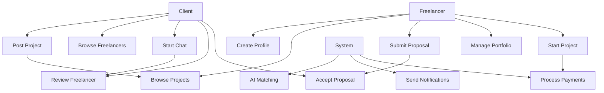
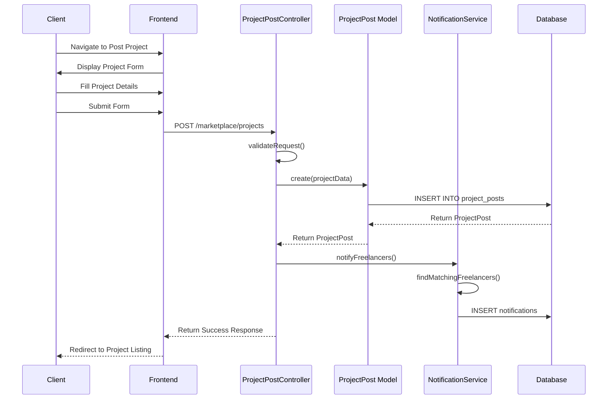
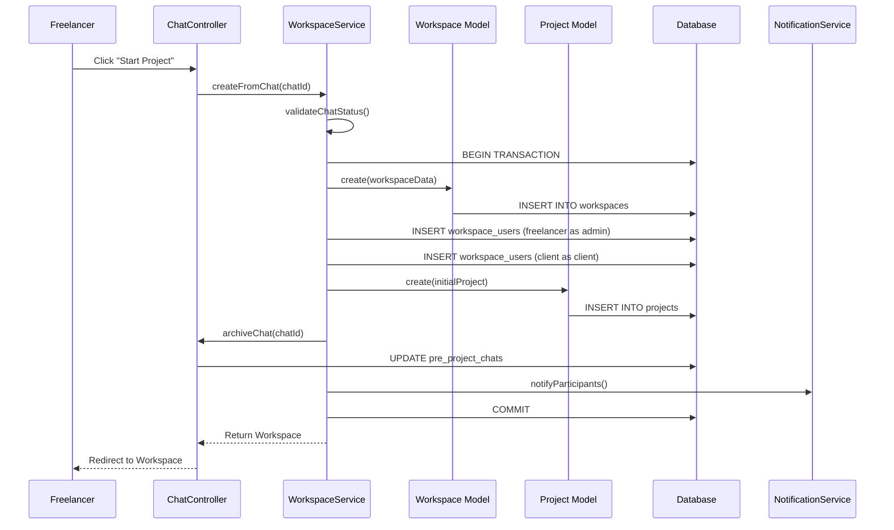
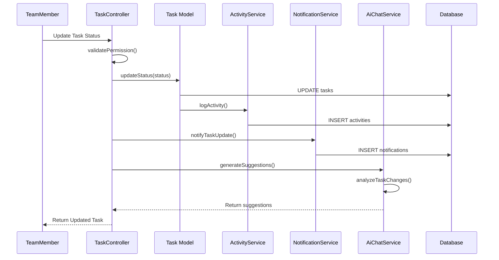
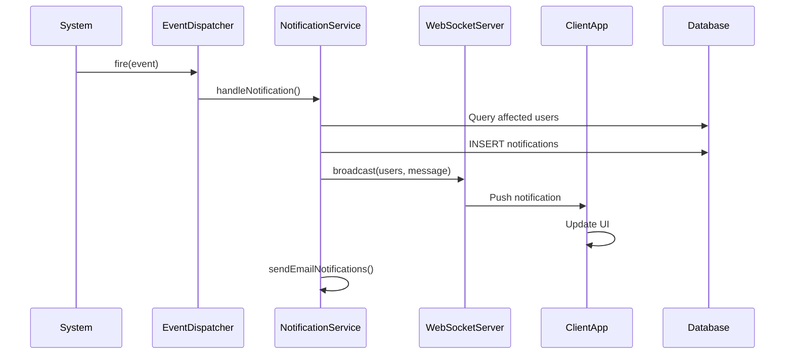

# 🎯 **Freelancer-First SaaS Platform - UML Diagram Documentation**

> **Purpose:** Complete technical documentation for drawing UML diagrams
> **Diagrams Covered:** Use Case, Class, Sequence, ER Diagrams
> **Target Audience:** System architects, developers, database designers

---

## 📋 **System Overview for UML Modeling**

### **System Boundaries**
```
┌─────────────────────────────────────────────────────────────┐
│                    FREELANCER PLATFORM                      │
├─────────────────────────────────────────────────────────────┤
│  ┌─────────────────┐    ┌─────────────────────────────────┐ │
│  │   MARKETPLACE   │    │         WORKSPACE               │ │
│  │   (Discovery)   │◄──►│      (Execution)                │ │
│  └─────────────────┘    └─────────────────────────────────┘ │
└─────────────────────────────────────────────────────────────┘
```

### **Core Actors**
- **Client**: Posts projects, hires freelancers, pays invoices
- **Freelancer**: Creates profiles, bids on projects, owns workspaces
- **Team Member**: Works on assigned tasks, limited access
- **System**: Automated processes, notifications, AI features

---

## 🎭 **USE CASE DIAGRAMS**

### **1. Marketplace Use Cases**



### **2. Workspace Use Cases**

```mermaid
graph TD
    Admin[Workspace Admin] --> WUC1[Create Project]
    Admin --> WUC2[Invite Members]
    Admin --> WUC3[Manage Billing]
    Admin --> WUC4[Generate Reports]
    
    Member[Team Member] --> WUC5[View Tasks]
    Member --> WUC6[Update Task Status]
    Member --> WUC7[Log Time]
    Member --> WUC8[Add Comments]
    
    Client[Client] --> WUC9[View Progress]
    Client --> WUC10[Approve Milestones]
    Client --> WUC11[Pay Invoices]
    
    System[System] --> WUC12[AI Suggestions]
    System --> WUC13[Real-time Updates]
    System --> WUC14[Backup Data]
```



### **3. Detailed Use Case Descriptions**

#### **UC1: Post Project**
```
Use Case: Post Project
Actor: Client
Description: Client creates a new project posting in the marketplace
Preconditions: Client is logged in, has completed profile
Main Flow:
1. Client navigates to "Post Project" page
2. System displays project creation form
3. Client fills in project details (title, description, budget, timeline)
4. Client uploads any relevant files
5. Client submits project for review
6. System validates project data
7. System publishes project to marketplace
Postconditions: Project is visible to freelancers
Exceptions: Invalid data, insufficient permissions
```

#### **UC10: Start Project**
```
Use Case: Start Project
Actor: Freelancer
Description: Freelancer initiates workspace creation after agreement
Preconditions: Agreement reached in pre-project chat
Main Flow:
1. Freelancer clicks "Start Project" in chat
2. System creates new workspace
3. System assigns freelancer as workspace owner
4. System adds client as workspace member
5. System archives pre-project chat
6. System creates initial project structure
7. System redirects to workspace dashboard
Postconditions: Workspace is ready for project execution
Exceptions: Insufficient permissions, system errors
```

---

## 🏗️ **CLASS DIAGRAMS**

### **1. Core Domain Models**

```mermaid
classDiagram
    class User {
        +int id
        +string name
        +string email
        +string usage_type
        +string avatar
        +datetime created_at
        +datetime updated_at
        +freelancerProfile()
        +clientProfile()
        +workspaces()
        +projects()
        +getAvatarUrl()
    }
    
    class FreelancerProfile {
        +int user_id
        +string title
        +text bio
        +json skills
        +decimal hourly_rate
        +string availability
        +json portfolio
        +boolean published
        +user()
        +reviews()
        +getSkillsArray()
    }
    
    class ClientProfile {
        +int user_id
        +string company_name
        +string industry
        +json billing_info
        +string contact_phone
        +user()
        +projects()
    }
    
    User ||--|| FreelancerProfile
    User ||--|| ClientProfile
```

### **2. Workspace System Classes**

```mermaid
classDiagram
    class Workspace {
        +int id
        +string name
        +text description
        +int owner_id
        +datetime created_at
        +datetime updated_at
        +owner()
        +users()
        +projects()
        +invitations()
        +getUserRole()
        +hasPermission()
    }
    
    class WorkspaceUser {
        +int workspace_id
        +int user_id
        +string role
        +datetime joined_at
        +workspace()
        +user()
    }
    
    class WorkspaceInvitation {
        +int id
        +int workspace_id
        +string email
        +string token
        +string status
        +datetime expires_at
        +workspace()
        +accept()
        +decline()
    }
    
    Workspace ||--o{ WorkspaceUser
    Workspace ||--o{ WorkspaceInvitation
    User ||--o{ WorkspaceUser
```

### **3. Project Management Classes**

```mermaid
classDiagram
    class Project {
        +int id
        +int workspace_id
        +int client_id
        +int created_by
        +string name
        +text description
        +string status
        +datetime start_date
        +datetime due_date
        +decimal budget
        +workspace()
        +client()
        +creator()
        +taskGroups()
        +teamMembers()
        +invoices()
        +canUpdate()
    }
    
    class TaskGroup {
        +int id
        +int project_id
        +string name
        +string color
        +int position
        +datetime archived_at
        +project()
        +tasks()
        +archive()
        +restore()
    }
    
    class Task {
        +int id
        +int group_id
        +int assignee_id
        +int created_by
        +string name
        +text description
        +string status
        +string priority
        +int position
        +datetime due_date
        +taskGroup()
        +assignee()
        +creator()
        +subtasks()
        +comments()
        +attachments()
        +timeLogs()
        +moveToGroup()
        +updateStatus()
    }
    
    Project ||--o{ TaskGroup
    TaskGroup ||--o{ Task
    Task ||--o{ Subtask
```

### **4. Marketplace Classes**

```mermaid
classDiagram
    class ProjectPost {
        +int id
        +int user_id
        +string title
        +text description
        +decimal budget_min
        +decimal budget_max
        +string status
        +json skills_required
        +datetime deadline
        +client()
        +chats()
        +publish()
        +archive()
    }
    
    class PreProjectChat {
        +int id
        +int client_id
        +int freelancer_id
        +string project_title
        +text project_description
        +decimal agreed_budget
        +string status
        +client()
        +freelancer()
        +messages()
        +startProject()
        +archive()
    }
    
    class PreProjectMessage {
        +int id
        +int chat_id
        +int sender_id
        +text content
        +string type
        +json attachments
        +datetime sent_at
        +chat()
        +sender()
        +markAsRead()
    }
    
    ProjectPost ||--o{ PreProjectChat
    PreProjectChat ||--o{ PreProjectMessage
    User ||--o{ ProjectPost
```

### **5. Communication & AI Classes**

```mermaid
classDiagram
    class AiChatService {
        +generateTaskSuggestions()
        +estimateTimeline()
        +analyzeProjectRisk()
        +recommendResources()
        +processNaturalLanguage()
    }
    
    class Notification {
        +int id
        +int user_id
        +string type
        +json data
        +datetime created_at
        +datetime read_at
        +user()
        +markAsRead()
        +sendEmail()
        +sendPush()
    }
    
    class Activity {
        +int id
        +int workspace_id
        +int user_id
        +string action
        +string subject_type
        +int subject_id
        +json data
        +datetime created_at
        +workspace()
        +user()
        +subject()
        +logActivity()
    }
    
    User ||--o{ Notification
    Workspace ||--o{ Activity
    User ||--o{ Activity
```

---

## 🔄 **SEQUENCE DIAGRAMS**

### **1. Project Creation Flow**



### **2. Workspace Creation from Chat**



### **3. Task Management Flow**



### **4. Real-time Notification Flow**



---

## 🗄️ **ENTITY RELATIONSHIP (ER) DIAGRAMS**

### **1. Core Database Schema**

```mermaid
erDiagram
    USERS {
        int id PK
        string name
        string email UK
        string password
        string usage_type
        string avatar
        datetime created_at
        datetime updated_at
        datetime archived_at
    }
    
    FREELANCER_PROFILES {
        int user_id PK,FK
        string title
        text bio
        json skills
        decimal hourly_rate
        string availability
        json portfolio
        boolean published
        datetime created_at
        datetime updated_at
    }
    
    CLIENT_PROFILES {
        int user_id PK,FK
        string company_name
        string industry
        json billing_info
        string contact_phone
        datetime created_at
        datetime updated_at
    }
    
    WORKSPACES {
        int id PK
        string name
        text description
        int owner_id FK
        datetime created_at
        datetime updated_at
    }
    
    WORKSPACE_USERS {
        int workspace_id PK,FK
        int user_id PK,FK
        string role
        datetime joined_at
    }
    
    PROJECTS {
        int id PK
        int workspace_id FK
        int client_id FK
        int created_by FK
        string name
        text description
        string status
        date start_date
        date due_date
        decimal budget
        datetime created_at
        datetime updated_at
    }
    
    PROJECT_USER_ACCESS {
        int project_id PK,FK
        int user_id PK,FK
        string role
        datetime assigned_at
    }
    
    TASK_GROUPS {
        int id PK
        int project_id FK
        string name
        string color
        int position
        datetime archived_at
        datetime created_at
        datetime updated_at
    }
    
    TASKS {
        int id PK
        int group_id FK
        int assignee_id FK
        int created_by FK
        string name
        text description
        string status
        string priority
        int position
        date due_date
        datetime created_at
        datetime updated_at
    }
    
    SUBTASKS {
        int id PK
        int task_id FK
        string name
        boolean completed
        date due_date
        datetime created_at
        datetime updated_at
    }
    
    USERS ||--|| FREELANCER_PROFILES
    USERS ||--|| CLIENT_PROFILES
    USERS ||--o{ WORKSPACE_USERS
    WORKSPACES ||--o{ WORKSPACE_USERS
    WORKSPACES ||--o{ PROJECTS
    USERS ||--o{ PROJECTS
    PROJECTS ||--o{ PROJECT_USER_ACCESS
    USERS ||--o{ PROJECT_USER_ACCESS
    PROJECTS ||--o{ TASK_GROUPS
    TASK_GROUPS ||--o{ TASKS
    TASKS ||--o{ SUBTASKS
```

### **2. Marketplace Schema**

```mermaid
erDiagram
    PROJECT_POSTS {
        int id PK
        int user_id FK
        string title
        text description
        decimal budget_min
        decimal budget_max
        string status
        json skills_required
        date deadline
        datetime created_at
        datetime updated_at
    }
    
    PRE_PROJECT_CHATS {
        int id PK
        int client_id FK
        int freelancer_id FK
        string project_title
        text project_description
        decimal agreed_budget
        string status
        datetime created_at
        datetime updated_at
    }
    
    PRE_PROJECT_MESSAGES {
        int id PK
        int chat_id FK
        int sender_id FK
        text content
        string type
        json attachments
        datetime sent_at
        datetime read_at
    }
    
    FREELANCER_REVIEWS {
        int id PK
        int client_id FK
        int freelancer_id FK
        int rating
        text comment
        json project_details
        datetime created_at
        datetime updated_at
    }
    
    CHAT_DELETIONS {
        int id PK
        int chat_id FK
        int user_id FK
        datetime deleted_at
    }
    
    USERS ||--o{ PROJECT_POSTS
    USERS ||--o{ PRE_PROJECT_CHATS
    PRE_PROJECT_CHATS ||--o{ PRE_PROJECT_MESSAGES
    USERS ||--o{ PRE_PROJECT_MESSAGES
    USERS ||--o{ FREELANCER_REVIEWS
    PRE_PROJECT_CHATS ||--o{ CHAT_DELETIONS
    USERS ||--o{ CHAT_DELETIONS
```

### **3. Supporting Tables Schema**

```mermaid
erDiagram
    COUNTRIES {
        int id PK
        string name
        string code
        string currency_code FK
    }
    
    CURRENCIES {
        int id PK
        string code UK
        string symbol
        string name
    }
    
    WORKSPACE_INVITATIONS {
        int id PK
        int workspace_id FK
        string email
        string token
        string status
        datetime created_at
        datetime expires_at
        datetime accepted_at
    }
    
    ACTIVITIES {
        int id PK
        int workspace_id FK
        int user_id FK
        string action
        string subject_type
        int subject_id
        json data
        datetime created_at
    }
    
    NOTIFICATIONS {
        int id PK
        int user_id FK
        string type
        json data
        datetime created_at
        datetime read_at
    }
    
    INVOICES {
        int id PK
        int project_id FK
        decimal amount
        string status
        date due_date
        datetime paid_at
        datetime created_at
        datetime updated_at
    }
    
    TIME_LOGS {
        int id PK
        int user_id FK
        int task_id FK
        decimal hours
        text description
        date date
        datetime created_at
        datetime updated_at
    }
    
    COMMENTS {
        int id PK
        int user_id FK
        string commentable_type
        int commentable_id
        text content
        datetime created_at
        datetime updated_at
    }
    
    ATTACHMENTS {
        int id PK
        string filename
        string path
        string mime_type
        int size
        string attachable_type
        int attachable_id
        datetime created_at
    }
    
    COUNTRIES ||--o{ CURRENCIES
    WORKSPACES ||--o{ WORKSPACE_INVITATIONS
    WORKSPACES ||--o{ ACTIVITIES
    USERS ||--o{ NOTIFICATIONS
    PROJECTS ||--o{ INVOICES
    TASKS ||--o{ TIME_LOGS
    USERS ||--o{ TIME_LOGS
    USERS ||--o{ COMMENTS
```

---

## 🔧 **TECHNICAL IMPLEMENTATION DETAILS**

### **1. Controller Methods for Key Use Cases**

#### **ProjectPostController::store()**
```php
public function store(Request $request): ProjectPost
{
    $validated = $request->validate([
        'title' => 'required|string|max:255',
        'description' => 'required|string',
        'budget_min' => 'required|numeric|min:0',
        'budget_max' => 'required|numeric|gt:budget_min',
        'skills_required' => 'required|array',
        'deadline' => 'required|date|after:today'
    ]);
    
    $projectPost = ProjectPost::create([
        'user_id' => Auth::id(),
        'title' => $validated['title'],
        'description' => $validated['description'],
        'budget_min' => $validated['budget_min'],
        'budget_max' => $validated['budget_max'],
        'skills_required' => $validated['skills_required'],
        'deadline' => $validated['deadline'],
        'status' => 'active'
    ]);
    
    // Trigger notifications to matching freelancers
    $this->notificationService->notifyMatchingFreelancers($projectPost);
    
    return $projectPost;
}
```

#### **WorkspaceService::createFromChat()**
```php
public function createFromChat(int $chatId): Workspace
{
    return DB::transaction(function () use ($chatId) {
        $chat = PreProjectChat::findOrFail($chatId);
        
        // Create workspace
        $workspace = Workspace::create([
            'name' => $chat->project_title,
            'description' => $chat->project_description,
            'owner_id' => $chat->freelancer_id
        ]);
        
        // Add participants
        $workspace->users()->attach($chat->freelancer_id, ['role' => 'admin']);
        $workspace->users()->attach($chat->client_id, ['role' => 'client']);
        
        // Create initial project
        $project = Project::create([
            'workspace_id' => $workspace->id,
            'client_id' => $chat->client_id,
            'created_by' => $chat->freelancer_id,
            'name' => $chat->project_title,
            'status' => 'planning'
        ]);
        
        // Archive chat
        $chat->update(['status' => 'completed']);
        
        // Log activity
        Activity::create([
            'workspace_id' => $workspace->id,
            'user_id' => $chat->freelancer_id,
            'action' => 'created_workspace',
            'subject_type' => Workspace::class,
            'subject_id' => $workspace->id
        ]);
        
        return $workspace;
    });
}
```

### **2. Model Relationships and Methods**

#### **User Model**
```php
class User extends Authenticatable
{
    // Relationships
    public function freelancerProfile(): HasOne
    {
        return $this->hasOne(FreelancerProfile::class);
    }
    
    public function clientProfile(): HasOne
    {
        return $this->hasOne(ClientProfile::class);
    }
    
    public function workspaces(): BelongsToMany
    {
        return $this->belongsToMany(Workspace::class)
            ->withPivot('role', 'joined_at');
    }
    
    public function projects(): BelongsToMany
    {
        return $this->belongsToMany(Project::class, 'project_user_access')
            ->withPivot('role', 'assigned_at');
    }
    
    // Methods
    public function getAvatarUrlAttribute(): string
    {
        if ($this->usage_type === 'freelancer' && $this->freelancerProfile?->avatar) {
            return Storage::url($this->freelancerProfile->avatar);
        }
        
        if ($this->avatar) {
            return Storage::url($this->avatar);
        }
        
        return $this->generateInitialAvatar();
    }
    
    public function canAccessWorkspace(Workspace $workspace): bool
    {
        return $workspace->users()->where('user_id', $this->id)->exists();
    }
}
```

#### **Project Model**
```php
class Project extends Model
{
    // Relationships
    public function workspace(): BelongsTo
    {
        return $this->belongsTo(Workspace::class);
    }
    
    public function client(): BelongsTo
    {
        return $this->belongsTo(User::class, 'client_id');
    }
    
    public function taskGroups(): HasMany
    {
        return $this->hasMany(TaskGroup::class)->orderBy('position');
    }
    
    public function teamMembers(): BelongsToMany
    {
        return $this->belongsToMany(User::class, 'project_user_access')
            ->withPivot('role', 'assigned_at');
    }
    
    // Methods
    public function canBeUpdatedBy(User $user): bool
    {
        $workspace = $this->workspace;
        $role = $workspace->getUserRole($user);
        
        return match($role) {
            'admin' => true,
            'member' => $this->teamMembers()->where('user_id', $user->id)->exists(),
            'client' => false,
            default => false
        };
    }
    
    public function getProgressAttribute(): float
    {
        $totalTasks = $this->tasks()->count();
        $completedTasks = $this->tasks()->where('status', 'done')->count();
        
        return $totalTasks > 0 ? ($completedTasks / $totalTasks) * 100 : 0;
    }
}
```

### **3. Service Classes**

#### **NotificationService**
```php
class NotificationService
{
    public function notifyMatchingFreelancers(ProjectPost $projectPost): void
    {
        $freelancers = $this->findMatchingFreelancers($projectPost);
        
        foreach ($freelancers as $freelancer) {
            Notification::create([
                'user_id' => $freelancer->id,
                'type' => 'new_project_match',
                'data' => [
                    'project_id' => $projectPost->id,
                    'project_title' => $projectPost->title,
                    'budget_range' => [
                        'min' => $projectPost->budget_min,
                        'max' => $projectPost->budget_max
                    ]
                ]
            ]);
            
            // Send email notification
            $freelancer->notify(new NewProjectMatchNotification($projectPost));
        }
    }
    
    private function findMatchingFreelancers(ProjectPost $projectPost): Collection
    {
        return FreelancerProfile::where('published', true)
            ->whereJsonContains('skills', $projectPost->skills_required)
            ->where('availability', 'available')
            ->where('hourly_rate', '<=', $projectPost->budget_max)
            ->with('user')
            ->get()
            ->pluck('user');
    }
}
```

#### **AiChatService**
```php
class AiChatService
{
    public function generateTaskSuggestions(Project $project): array
    {
        $projectData = [
            'name' => $project->name,
            'description' => $project->description,
            'existing_tasks' => $project->tasks()->with('subtasks')->get(),
            'team_skills' => $this->getTeamSkills($project),
            'industry' => $this->getProjectIndustry($project)
        ];
        
        return $this->aiClient->suggestTasks($projectData);
    }
    
    public function estimateTimeline(array $tasks): array
    {
        $complexityFactors = [
            'simple' => 1.0,
            'medium' => 1.5,
            'complex' => 2.5
        ];
        
        $totalHours = 0;
        
        foreach ($tasks as $task) {
            $complexity = $this->determineComplexity($task);
            $baseHours = $this->getBaseHours($task['type']);
            $totalHours += $baseHours * $complexityFactors[$complexity];
        }
        
        return [
            'total_hours' => $totalHours,
            'working_days' => ceil($totalHours / 8),
            'calendar_weeks' => ceil($totalHours / 40),
            'confidence' => $this->calculateConfidence($tasks)
        ];
    }
}
```

---

## 📊 **SYSTEM METRICS AND CONSTRAINTS**

### **1. Database Constraints**

```sql
-- Primary Keys
ALTER TABLE users ADD PRIMARY KEY (id);
ALTER TABLE workspaces ADD PRIMARY KEY (id);
ALTER TABLE projects ADD PRIMARY KEY (id);

-- Foreign Keys
ALTER TABLE workspace_users 
ADD CONSTRAINT fk_workspace_users_workspace 
FOREIGN KEY (workspace_id) REFERENCES workspaces(id) ON DELETE CASCADE;

ALTER TABLE workspace_users 
ADD CONSTRAINT fk_workspace_users_user 
FOREIGN KEY (user_id) REFERENCES users(id) ON DELETE CASCADE;

-- Unique Constraints
ALTER TABLE users ADD UNIQUE INDEX idx_users_email (email);
ALTER TABLE workspaces ADD UNIQUE INDEX idx_workspaces_name_owner (name, owner_id);

-- Indexes for Performance
CREATE INDEX idx_projects_workspace_status ON projects(workspace_id, status);
CREATE INDEX idx_tasks_assignee_status ON tasks(assignee_id, status);
CREATE INDEX idx_notifications_user_read ON notifications(user_id, read_at);
```

### **2. API Rate Limits**

```php
// Rate Limiting Configuration
'api' => [
    'throttle:api' => [
        'limit' => 1000, // requests per hour
        'burst' => 100,  // burst capacity
    ],
    'throttle:uploads' => [
        'limit' => 100,  // uploads per hour
        'burst' => 10,
    ],
    'throttle:search' => [
        'limit' => 1000, // searches per hour
        'burst' => 50,
    ]
]
```

### **3. Performance Benchmarks**

```yaml
Response Times:
  - Page Load: < 2 seconds
  - API Calls: < 500ms
  - Database Queries: < 100ms
  - File Uploads: < 5 seconds

Scalability:
  - Concurrent Users: 10,000+
  - Database Connections: 1000+
  - File Storage: 10TB+
  - API Requests: 1M+ per day

Security:
  - Password Hashing: bcrypt
  - Session Timeout: 24 hours
  - Token Expiry: 1 hour
  - Max Login Attempts: 5 per 15 minutes
```

---

## 🎯 **UML DIAGRAM DRAWING INSTRUCTIONS**

### **1. Use Case Diagram Drawing Steps**

1. **Identify Actors**: Client, Freelancer, Team Member, System
2. **Define Boundaries**: Marketplace bubble, Workspace bubble
3. **Draw Use Cases**: Oval shapes for each major function
4. **Connect Actors**: Lines from actors to relevant use cases
5. **Add Relationships**: <<include>> and <<extend>> relationships
6. **Label Everything**: Clear, descriptive names

### **2. Class Diagram Drawing Steps**

1. **Identify Classes**: From domain models
2. **Define Attributes**: Private/protected/public visibility
3. **Define Methods**: With parameters and return types
4. **Establish Relationships**: Inheritance, composition, aggregation
5. **Add Multiplicity**: 1..*, 0..1, etc.
6. **Show Navigation**: Arrow directions for associations

### **3. Sequence Diagram Drawing Steps**

1. **Identify Participants**: Actors, controllers, models, services
2. **Draw Lifelines**: Vertical dashed lines
3. **Add Messages**: Horizontal arrows with method names
4. **Show Activation**: Rectangles on lifelines
5. **Include Conditions**: Alt/else blocks for decision points
6. **Add Return Values**: Dashed lines for responses

### **4. ER Diagram Drawing Steps**

1. **Identify Entities**: All database tables
2. **Define Attributes**: Primary keys, foreign keys, data types
3. **Establish Relationships**: One-to-one, one-to-many, many-to-many
4. **Add Cardinality**: 1, 0..1, *, 0..*
5. **Show Constraints**: Unique, not null, check constraints
6. **Include Indexes**: Performance optimization indicators

---

## 📋 **CHECKLIST FOR COMPLETE UML DOCUMENTATION**

### **✅ Use Case Diagrams**
- [ ] Marketplace use cases (posting, browsing, chatting)
- [ ] Workspace use cases (projects, tasks, collaboration)
- [ ] Authentication use cases (login, registration, profiles)
- [ ] Administrative use cases (invitations, billing, reports)
- [ ] AI integration use cases (suggestions, automation)

### **✅ Class Diagrams**
- [ ] Core domain models (User, Workspace, Project)
- [ ] Marketplace models (ProjectPost, Chat, Review)
- [ ] Task management models (Task, TaskGroup, Subtask)
- [ ] Communication models (Notification, Activity, Message)
- [ ] Service classes (AI, Notification, Workspace)

### **✅ Sequence Diagrams**
- [ ] User registration and onboarding
- [ ] Project posting and discovery
- [ ] Chat negotiation and agreement
- [ ] Workspace creation and setup
- [ ] Task creation and management
- [ ] Real-time notifications
- [ ] AI-powered suggestions

### **✅ ER Diagrams**
- [ ] Core user and workspace tables
- [ ] Project and task management tables
- [ ] Marketplace and communication tables
- [ ] Supporting tables (notifications, activities, etc.)
- [ ] All relationships and constraints

---

## 🎉 **CONCLUSION**

This comprehensive UML documentation provides everything needed to create detailed technical diagrams for your freelancer-first SaaS platform. The documentation includes:

- **Complete use case analysis** with all actors and interactions
- **Detailed class diagrams** with relationships and methods
- **Sequence diagrams** for critical business flows
- **Comprehensive ER diagrams** with all tables and relationships
- **Technical implementation details** for developers
- **Drawing instructions** for creating professional UML diagrams

Use this documentation as your reference guide when creating UML diagrams in tools like:
- **Draw.io** (free, web-based)
- **Lucidchart** (professional)
- **Visual Paradigm** (enterprise)
- **PlantUML** (code-based)
- **StarUML** (desktop application)

The platform architecture is well-structured and ready for comprehensive UML modeling! 🚀
